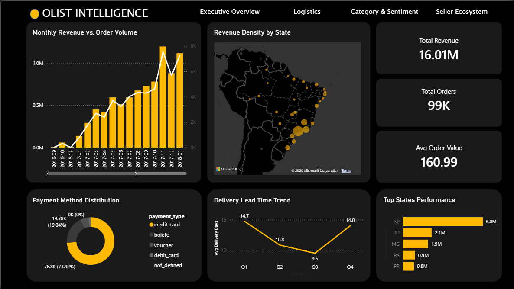
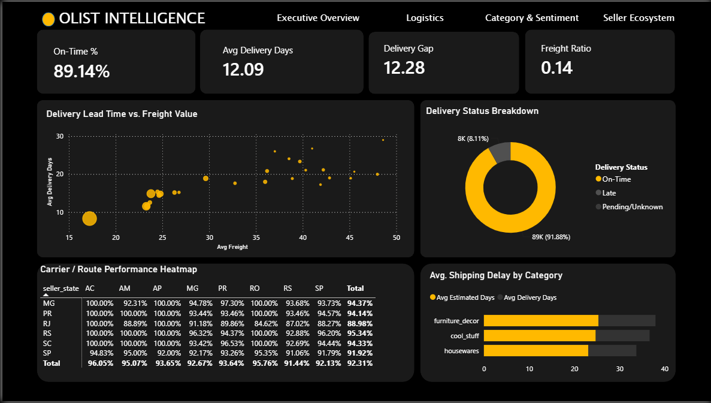
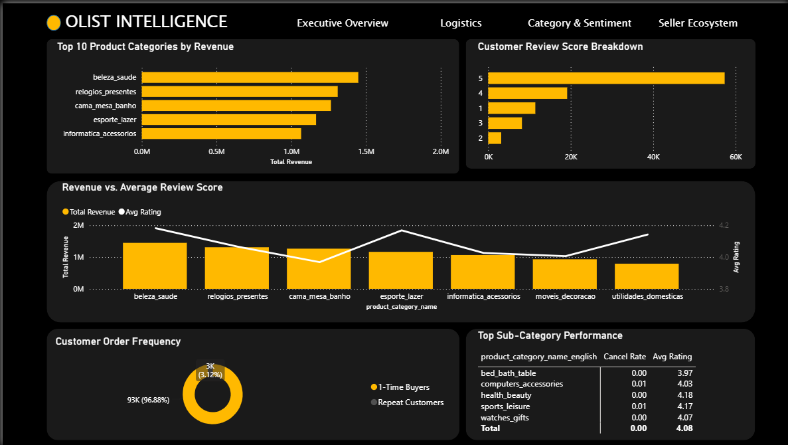
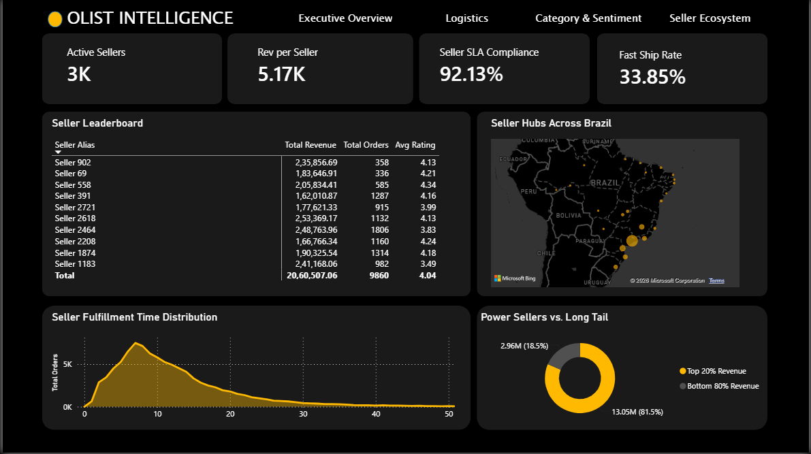

# Olist E-Commerce Analytics

## Project Overview
This project analyzes the Olist dataset, a Brazilian e-commerce marketplace dataset containing roughly 99K orders. Through advanced SQL analysis and a comprehensive Power BI dashboard, the core question this analysis answers is: *Is this business's growth healthy, and where are the operational weak points?*

## Tools Used
- **SQL (PostgreSQL syntax):** Data exploration, aggregation, time series analysis, and advanced querying (CTEs, Window Functions).
- **Power BI:** Interactive executive dashboards for visual storytelling and metric monitoring.

## Dashboard
Below are the key pages from the Power BI dashboard, highlighting different aspects of the business:

### Executive Overview

*A high-level view of revenue trends, total orders, and average order value, showcasing the explosive growth from 2016 to 2018.*

### Logistics

*Analyzes delivery lead times, on-time delivery rates, and carrier performance across different states to identify supply chain bottlenecks.*

### Category & Sentiment

*Explores product performance, revenue vs. review scores, and customer sentiment distribution across major categories.*

### Seller Ecosystem

*Highlights seller performance, revenue distribution among top sellers, and geographical clusters of active sellers.*

## Key Findings

1. **Acquisition-Driven Growth (Not Retention-Driven):** Revenue grew ~150x from near-zero (Sep 2016) to 1M+/month by late 2017, but only 3.12% of customers are repeat buyers. This indicates that growth is heavily reliant on new customer acquisition rather than retention. *(See Executive Overview dashboard & [Query 11: Repeat Customers](assets/query_results/query_11.csv))*
2. **High Seller Concentration Risk:** The top 20% of sellers generate 81.5% of total revenue (13.05M of 16.01M). Losing a few key sellers could severely impact marketplace revenue. *(See Seller Ecosystem dashboard & [Query 4: Top 5 sellers by revenue](assets/query_results/query_4.csv))*
3. **Geographic Concentration Risk:** São Paulo alone accounts for 6.0M of 16.01M total revenue, which is more than the next four states combined. *(See Executive Overview dashboard & [Query 2: Revenue by state](assets/query_results/query_2.csv))*
4. **Logistics Weak Point in RJ:** Rio de Janeiro (RJ) has the weakest logistics performance at 88.98% on-time route delivery vs 94%+ in other major states, despite being the second-largest revenue state by volume. *(See Logistics dashboard)*
5. **Conservative Delivery Estimates:** Average delivery time is 12.09 days but the estimated delivery window is roughly double that. This means delivery estimates are highly conservative and deliveries consistently beat expectations (89.14% on-time rate). *(See [Query 8: Average delivery time](assets/query_results/query_8.csv) & [Query 9: On-time vs late deliveries](assets/query_results/query_9.csv))*
6. **Skewed Review Scores:** Review scores are heavily skewed toward 5-star (~60K of ~99K reviews), making the simple average rating a weak standalone signal without checking the distribution shape. *(See Category & Sentiment dashboard & [Query 10: Review scores distribution](assets/query_results/query_10.csv))*

## SQL Highlights
The analysis utilizes advanced SQL techniques to answer complex business questions:

- **Top Customer per State (Window Functions):** Uses `ROW_NUMBER() OVER(PARTITION BY...)` to rank customers by total spend within each state.
  | customer_state | customer_unique_id | total_spend (BRL) |
  |---|---|---|
  | RJ | 0a0a92112bd4c708ca5fde585afaa872 | 13,664.08 |
  | SC | 46450c74a0d8c5ca9395da1daac6c120 | 9,553.02 |
  | ES | 763c8b1c9c68a0229c42c9fc6f662b93 | 7,274.88 |
  | MS | dc4802a71eae9be1dd28f5d788ceb526 | 6,929.31 |
  | SP | ff4159b92c40ebe40454e3e6a7c35ed6 | 6,726.66 |
  
  *This output isolates the absolute highest-value 'whales' in key geographic regions, enabling targeted VIP marketing interventions.*

- **Products with 100% Late Delivery Rate (CTEs & Aggregations):** Utilizes Common Table Expressions to calculate delivery stats and filter for products that consistently fail delivery estimates.
  | product_id | total_orders | late_orders |
  |---|---|---|
  | 05b515fdc76e888aada3c6d66c201dff | 10 | 10 |
  | 270516a3f41dc035aa87d220228f844c | 10 | 10 |
  | b80b61cc25558319e7d8e262786ca7af | 6 | 6 |
  | 643d903164c4b6ba8bd0b68348e9d135 | 6 | 6 |
  | a8fd2715c837d04bac16cf90155919f8 | 6 | 6 |
  
  *This exposes specific problematic SKUs that are structurally flawed in logistics routing and guarantee a poor customer experience.*

- **Seller Performance Ranking (Aggregations & HAVING):** Combines revenue, total orders, and average review scores to rank sellers, demonstrating multi-metric aggregation.
  | seller_id | total_orders | total_revenue (BRL) | avg_review_score |
  |---|---|---|---|
  | 4869f7a5dfa277a7dca6462dcf3b52b2 | 1132 | 229,472.63 | 4.12 |
  | 53243585a1d6dc2643021fd1853d8905 | 358 | 222,776.05 | 4.08 |
  | 4a3ca9315b744ce9f8e9374361493884 | 1806 | 202,999.12 | 3.80 |
  | fa1c13f2614d7b5c4749cbc52fecda94 | 585 | 194,042.03 | 4.34 |
  | 7c67e1448b00f6e969d365cea6b010ab | 982 | 189,417.67 | 3.35 |
  
  *This provides a balanced scoreboard to evaluate seller quality beyond just volume, penalizing those who drive revenue but deliver poor experiences.*

- **Full Category-to-Seller-to-State Chain (Multiple CTEs & JOINs):** Chains multiple CTEs to merge product, review, seller, and geographical data, identifying top performers across categories.
  | product_category_name | total_revenue (BRL) | avg_review_score | top_seller | top_state |
  |---|---|---|---|---|
  | beleza_saude (Health/Beauty) | 1,263,138.54 | 4.14 | edb1ef5e... | SP |
  | relogios_presentes (Watches) | 1,206,075.33 | 4.02 | 4869f7a5... | SP |
  | cama_mesa_banho (Bed/Bath) | 1,050,936.61 | 3.90 | 4a3ca931... | SP |
  | esporte_lazer (Sports) | 993,656.51 | 4.11 | 218d46b8... | SP |
  | informatica_acessorios | 919,640.54 | 3.93 | 25c5c91f... | SP |
  
  *This master view connects every node of the marketplace transaction (what is sold, who sells it, how it's rated, and where it goes) into a single analytical snapshot.*

## Sample Query Outputs
In addition to the highlights above, the analysis explores basic operations and distribution. Here are a few core sample cuts:

### On-Time vs. Late Deliveries (Query 9)
| delivery_status | total_orders | percentage |
|---|---|---|
| Late | 7,834 | 8.12% |
| On-time | 88,644 | 91.88% |

*This high-level breakdown highlights the overall reliability of the logistics network, showing that while late deliveries happen (~8%), the vast majority of orders arrive within the estimated window.*

### Customer Spending Segments (Query 22)
| customer_unique_id | total_spend (BRL) | spending_segment |
|---|---|---|
| 0a0a92112bd4c708ca5fde585afaa872 | 13,664.08 | High Value |
| 46450c74a0d8c5ca9395da1daac6c120 | 9,553.02 | High Value |
| da122df9eeddfedc1dc1f5349a1a690c | 7,571.63 | High Value |
| 763c8b1c9c68a0229c42c9fc6f662b93 | 7,274.88 | High Value |
| dc4802a71eae9be1dd28f5d788ceb526 | 6,929.31 | High Value |

*By segmenting customers into tiers based on their lifetime spend, we can identify the most valuable accounts that might warrant exclusive loyalty programs or targeted re-engagement campaigns.*

### Category-wise Revenue (Query 15)
| product_category_name | total_revenue (BRL) |
|---|---|
| beleza_saude | 1,258,681.34 |
| relogios_presentes | 1,205,005.68 |
| cama_mesa_banho | 1,036,988.68 |
| esporte_lazer | 988,048.97 |
| informatica_acessorios | 911,954.32 |

*This ranks the product categories by total revenue generated, revealing that Health/Beauty and Watches dominate the marketplace's cash flow.*

> **Note:** Minor revenue variance (~0.3%) between this and the Category-to-Seller-to-State chain query (Query 24) is expected — Query 24 joins on reviews, which aren't strictly 1:1 with orders, causing slight row duplication in the aggregate. Query 15 is the cleaner source of truth for category revenue.

## Repo Structure
```text
.
├── assets/
│   ├── category_and_sentiment.png
│   ├── executive_overview.png
│   ├── logistics.png
│   ├── seller_ecosystem.png
│   └── query_results/      # CSV outputs of the 24 SQL queries
├── dashboards/
│   └── powerbi_executive.pbix
├── data/                   # Raw CSV datasets
├── sql/
│   ├── olist.sql           # Core analysis queries
│   └── olist_Helper.sql
└── README.md
```

## Author
* **Yash Sharma**
* [LinkedIn](https://www.linkedin.com/in/yash-sharma-k/)
* [GitHub](https://github.com/kaizen105)
